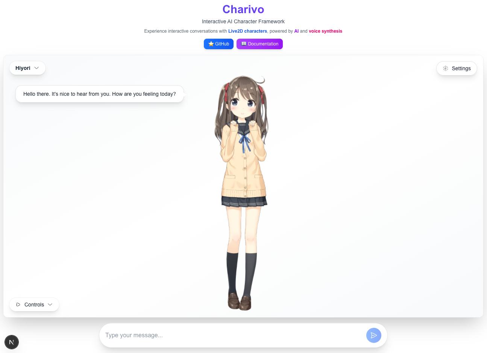

# 🧩✨ Charivo

**A modular Live2D + LLM framework for interactive character experiences**

Charivo lets you create interactive AI characters with Live2D animations, voice synthesis, and natural language conversations. Mix and match components like LEGO blocks - swap LLM providers, renderers, TTS engines, and more with ease! ✨

## 🎮 [Live Demo](https://charivo.vercel.app/)

Try out Charivo in action at **[charivo.vercel.app](https://charivo.vercel.app/)**



## 🎯 Why Charivo?

### Before (Raw Live2D SDK)
```typescript
// 100+ lines of boilerplate
import { CubismFramework } from "@framework/live2dcubismframework";
// ... 10+ more imports
// ... Manual GL context setup
// ... Complex model loading
// ... Animation loop management
// 😫 Hours of setup time
```

### After (Charivo)
```typescript
import { createLive2DRenderer } from "@charivo/render-live2d";

const renderer = createLive2DRenderer({ canvas });
await renderer.initialize();
await renderer.loadModel("/live2d/model.model3.json");
// ✨ 3 lines, done in seconds!
```

## ✨ Features

- 🧩 **Simple Live2D** - 90% less code than raw SDK, just 3 lines to render!
- 🤖 **Smart Conversations** - Powered by OpenAI GPT or custom LLM clients
- 🔊 **Voice Synthesis** - Multiple TTS options: Web Speech API, OpenAI TTS, Remote API
- 💋 **Auto Lip-Sync** - Mouth moves naturally synchronized with speech audio
- 🎭 **Emotion System** - LLM-driven expressions and motions with emotion tags
- 📦 **Plug & Play** - Modular architecture, swap any component easily
- ⚡ **TypeScript First** - Full type safety and IntelliSense support
- 🎨 **Framework Agnostic** - Works with React, Vue, or vanilla JavaScript
- 🔐 **Secure by Design** - Client/server separation keeps API keys safe

## 🚀 Quick Start

### Installation

```bash
# Clone the repository
git clone https://github.com/zeikar/charivo.git
cd charivo

# Install dependencies
pnpm install

# Build packages
pnpm build

# Set up pre-commit hooks (recommended for contributors)
pnpm setup:hooks

# Run the demo
cd examples/web
pnpm dev
```

### Basic Usage

```typescript
import { Charivo } from "@charivo/core";
import { createLLMManager } from "@charivo/llm-core";
import { OpenAILLMClient } from "@charivo/llm-client-openai";
import { createTTSManager } from "@charivo/tts-core";
import { createWebTTSPlayer } from "@charivo/tts-player-web";
import { createRenderManager } from "@charivo/render-core";
import { createLive2DRenderer } from "@charivo/render-live2d";

// 1. Create Charivo instance
const charivo = new Charivo();

// 2. Setup LLM (stateless client wrapped by stateful manager)
const llmClient = new OpenAILLMClient({ apiKey: "your-api-key" });
const llmManager = createLLMManager(llmClient);
charivo.attachLLM(llmManager);

// 3. Setup TTS (stateless player wrapped by stateful manager)
const ttsPlayer = createWebTTSPlayer(); // Browser's built-in speech
const ttsManager = createTTSManager(ttsPlayer);
charivo.attachTTS(ttsManager);

// 4. Setup Renderer (stateless renderer wrapped by stateful manager)
const renderer = createLive2DRenderer({ canvas: canvasElement });
await renderer.initialize();
await renderer.loadModel("/live2d/hiyori/hiyori.model3.json");
const renderManager = createRenderManager(renderer);
charivo.attachRenderer(renderManager);

// 5. Set character with emotion mappings
charivo.setCharacter({
  id: "hiyori",
  name: "Hiyori",
  personality: "Cheerful and helpful AI assistant",
  emotionMappings: [
    {
      emotion: Emotion.HAPPY,
      expression: "smile",
      motion: { group: "TapBody", index: 0 }
    },
    {
      emotion: Emotion.SAD,
      expression: "sad",
      motion: { group: "Idle", index: 1 }
    },
    // ... more emotions
  ]
});

// 6. Start chatting!
await charivo.userSay("Hello!");
// → LLM generates response with emotion tags: "Hello! [happy] Nice to meet you!"
// → Emotion tag parsed and removed: "Hello! Nice to meet you!"
// → TTS speaks the cleaned response
// → Renderer animates with emotion-based expression and motion
// → Mouth moves with lip-sync
```

**That's it!** Your AI character is now alive with:
- ✨ Natural language conversation (LLM)
- 🔊 Voice synthesis (TTS)
- 💋 Synchronized lip movement
- 🎭 Emotion-driven expressions and motions

## 📦 Packages

### Core Packages
| Package | Description |
|---------|-------------|
| [`@charivo/core`](./packages/core) | Core framework with event system and character management |
| [`@charivo/shared`](./packages/shared) | Shared utilities and types |

### LLM (Language Model) Packages
| Package | Description |
|---------|-------------|
| [`@charivo/llm-core`](./packages/llm-core) | Core utilities and helpers for LLM functionality |
| [`@charivo/llm-client-openai`](./packages/llm-client-openai) | OpenAI LLM client (local/testing) |
| [`@charivo/llm-client-remote`](./packages/llm-client-remote) | Remote HTTP LLM client (client-side) |
| [`@charivo/llm-client-stub`](./packages/llm-client-stub) | Stub LLM client for testing |
| [`@charivo/llm-provider-openai`](./packages/llm-provider-openai) | OpenAI LLM provider (server-side) |

### TTS (Text-to-Speech) Packages
| Package | Description |
|---------|-------------|
| [`@charivo/tts-core`](./packages/tts-core) | Core TTS functionality with audio processing and lip-sync integration |
| [`@charivo/tts-player-web`](./packages/tts-player-web) | Web Speech API TTS player |
| [`@charivo/tts-player-remote`](./packages/tts-player-remote) | Remote HTTP TTS player (client-side) |
| [`@charivo/tts-player-openai`](./packages/tts-player-openai) | OpenAI TTS player |
| [`@charivo/tts-provider-openai`](./packages/tts-provider-openai) | OpenAI TTS provider (server-side) |

### Rendering Packages
| Package | Description |
|---------|-------------|
| [`@charivo/render-core`](./packages/render-core) | Core rendering functionality with state management, lip-sync coordination, and motion control |
| [`@charivo/render-live2d`](./packages/render-live2d) | Simple Live2D renderer - 90% less code than raw SDK! |
| [`@charivo/render-stub`](./packages/render-stub) | Stub renderer for testing |

## 🎯 Examples

### Minimal Example (3 lines!)

The simplest way to render a Live2D character:

```typescript
import { createLive2DRenderer } from "@charivo/render-live2d";

const renderer = createLive2DRenderer({ canvas });
await renderer.initialize();
await renderer.loadModel("/live2d/model.model3.json");
// Done! Your character is now rendering.
```

**90% less code than raw Live2D SDK!** 🎉

### Production Example

Full setup with all features:

```typescript
// Setup (see Basic Usage above)
const charivo = new Charivo();
// ... attach LLM, TTS, renderer
// ... setCharacter

// Simple conversation
await charivo.userSay("What's the weather?");
// → "Let me check that for you!"

// Character speaks with emotions
await charivo.userSay("That's amazing!");
// → Happy motion + big smile + "I'm glad you like it!"

// Automatic lip-sync during speech
await charivo.userSay("Tell me a story");
// → Mouth moves naturally with speech audio
```

### Web Demo

A complete Next.js application showcasing all features using the new modular architecture:
- Live2D character animation with `@charivo/render-live2d`
- LLM conversation with `@charivo/llm-core` + client/provider separation
- Text-to-speech with `@charivo/tts-core` + player/provider architecture
- Real-time lip-sync animation synchronized with speech audio
- Interactive chat interface

```bash
cd examples/web
pnpm dev
```

Open [http://localhost:3000](http://localhost:3000) to see the demo.

The example demonstrates:
- **Client-side**: Using remote LLM/TTS clients for secure API access
- **Server-side**: API routes with OpenAI providers
- **Modular design**: Easy switching between different implementations

## 🏗️ Architecture

Charivo follows a modular, layered architecture with clear separation between stateful managers and stateless implementations:

```
┌─────────────────────────────────────┐
│           Your App                  │  ←─ Next.js, React, Vue, etc.
├─────────────────────────────────────┤
│         @charivo/core               │  ←─ Event bus, types, interfaces
├─────────────────────────────────────┤
│  ┌─────────────────────────────┐   │
│  │      LLM Layer              │   │
│  │  ┌──────────────────────┐   │   │
│  │  │  LLMManager          │   │   │  ←─ Stateful (history, character)
│  │  │  (@charivo/llm-core) │   │   │
│  │  └──────────┬───────────┘   │   │
│  │             ▼               │   │
│  │  ┌──────────────────────┐   │   │
│  │  │  LLM Clients         │   │   │  ←─ Stateless (API calls)
│  │  │  OpenAI, Remote, etc │   │   │
│  │  └──────────────────────┘   │   │
│  └─────────────────────────────┘   │
│  ┌─────────────────────────────┐   │
│  │      TTS Layer              │   │
│  │  ┌──────────────────────┐   │   │
│  │  │  TTSManager          │   │   │  ←─ Stateful (audio, events)
│  │  │  (@charivo/tts-core) │   │   │
│  │  └──────────┬───────────┘   │   │
│  │             ▼               │   │
│  │  ┌──────────────────────┐   │   │
│  │  │  TTS Players         │   │   │  ←─ Stateless (audio playback)
│  │  │  Web, Remote, OpenAI │   │   │
│  │  └──────────────────────┘   │   │
│  └─────────────────────────────┘   │
│  ┌─────────────────────────────┐   │
│  │    Rendering Layer          │   │
│  │  ┌──────────────────────┐   │   │
│  │  │  RenderManager       │   │   │  ←─ Stateful (lip-sync, motion)
│  │  │  (@charivo/render-core)│  │   │
│  │  └──────────┬───────────┘   │   │
│  │             ▼               │   │
│  │  ┌──────────────────────┐   │   │
│  │  │  Renderers           │   │   │  ←─ Stateless (rendering)
│  │  │  Live2D, 3D, etc     │   │   │
│  │  └──────────────────────┘   │   │
│  └─────────────────────────────┘   │
├─────────────────────────────────────┤
│      Server-Side Providers          │  ←─ OpenAI API, Custom APIs
└─────────────────────────────────────┘
```

### Architecture Benefits

- **Manager Pattern**: Stateful managers wrap stateless implementations for clean separation
- **Easy Testing**: Mock stateless components without touching business logic
- **Flexibility**: Swap implementations (Live2D → 3D, Web Speech → OpenAI TTS) without changing managers
- **Reusability**: Use renderers/clients independently or with managers
- **Type Safety**: Full TypeScript support across all layers

## 🔧 Creating Custom Components

### Custom LLM Client
```typescript
import { LLMClient, Message, Character } from "@charivo/core";
import { createLLMManager } from "@charivo/llm-core";

class CustomLLMClient implements LLMClient {
  async initialize(): Promise<void> {
    // Setup your LLM
  }

  async chat(messages: Message[], character?: Character): Promise<string> {
    // Your custom LLM API logic here
    return "Custom response";
  }

  async destroy(): Promise<void> {
    // Cleanup
  }
}

// Use with LLM Manager
const llmManager = createLLMManager(new CustomLLMClient());
```

### Custom TTS Components

Charivo provides multiple TTS (Text-to-Speech) options with clear client/server separation:

#### Web Speech API (Browser-native)
```typescript
import { createWebTTSPlayer } from "@charivo/tts-player-web";
import { createTTSManager } from "@charivo/tts-core";

// Uses browser's built-in speech synthesis - no server required
const player = createWebTTSPlayer();
const ttsManager = createTTSManager(player);
```

#### Remote TTS (Server-powered, Client-safe)
```typescript
import { createRemoteTTSPlayer } from "@charivo/tts-player-remote";
import { createTTSManager } from "@charivo/tts-core";

// Client-side player that calls your server API
const player = createRemoteTTSPlayer({
  apiEndpoint: "/api/tts" // Your server endpoint
});
const ttsManager = createTTSManager(player);
```

**⚠️ Important**: The Remote TTS player calls your server API. This keeps API keys secure on the server side. You need to implement a server endpoint like `/api/tts` using `@charivo/tts-provider-openai`.

#### OpenAI TTS Provider (Server-side only)
```typescript
import { createOpenAITTSProvider } from "@charivo/tts-provider-openai";

// Server-side provider for API routes
// ⚠️ Only use in Node.js/server environments
const provider = createOpenAITTSProvider({
  apiKey: process.env.OPENAI_API_KEY!,
  defaultVoice: "alloy",
  defaultModel: "tts-1-hd"
});

// In your API route (Next.js example)
export async function POST(request: NextRequest) {
  const { text } = await request.json();
  const audioBuffer = await provider.generateSpeech(text);
  return new NextResponse(audioBuffer, {
    headers: { "Content-Type": "audio/mpeg" }
  });
}
```

#### Custom TTS Player
```typescript
import { TTSPlayer } from "@charivo/core";
import { createTTSManager } from "@charivo/tts-core";

class CustomTTSPlayer implements TTSPlayer {
  async initialize(): Promise<void> {
    // Setup your TTS
  }

  async speak(text: string): Promise<void> {
    // Your custom TTS implementation
  }

  async stop(): Promise<void> {
    // Stop playback
  }

  async destroy(): Promise<void> {
    // Cleanup
  }
}

const ttsManager = createTTSManager(new CustomTTSPlayer());
```

## 🎯 Core Concepts

### Component Types

#### **Managers** (Stateful)
- Handle conversation history and character context
- Manage session state and user interactions
- Examples: `LLMManager` from `@charivo/llm-core`

#### **Clients & Players** (Stateless) 
- Focus on API communication and data processing
- No session state - pure input/output functions
- Examples: `RemoteLLMClient`, `WebTTSPlayer`

#### **Providers** (Server-side)
- Handle direct API integration with external services
- Manage API keys and authentication securely
- Examples: `OpenAILLMProvider`, `OpenAITTSProvider`

### Implementation Options

| Component | Available Types | Use Case |
|-----------|----------------|----------|
| **LLM** | `openai-client`, `remote-client`, `stub-client` | Client-side conversation |
| | `openai-provider` | Server-side API integration |
| **TTS** | `web-player`, `remote-player`, `openai-player` | Client-side audio playback |
| | `openai-provider` | Server-side audio generation |
| **Rendering** | `live2d-renderer`, `stub-renderer` | Character visualization |

## 🎨 Live2D Setup

1. **Get a Live2D model** (`.model3.json` and assets)
2. **Place in your public directory**
3. **Load the model**:

```typescript
await renderer.loadModel("/path/to/your/model.model3.json");
```

### Lip-Sync Features

Charivo automatically provides lip-sync animation when TTS is active:

- **Audio Analysis**: Analyzes speech audio in real-time for mouth movement timing
- **Parameter Control**: Controls Live2D mouth parameters (`ParamMouthOpenY`) based on audio volume
- **Smooth Animation**: Provides natural-looking mouth movements synchronized with speech
- **Automatic Integration**: Works out-of-the-box with any TTS player (Web Speech, OpenAI TTS, etc.)

```typescript
// Lip-sync happens automatically when character speaks
await charivo.userSay("Hello! Watch my mouth move!");
// Character will speak with synchronized lip movement
```

The demo includes a free Hiyori model from Live2D samples with lip-sync support.

## 🎭 Emotion System

Charivo features an intelligent emotion system that allows LLMs to control character expressions and motions through emotion tags.

### How It Works

1. **LLM generates response with emotion tags**:
   ```
   "Hello! [happy] Nice to meet you!"
   ```

2. **Charivo parses and cleans the text**:
   - Detected emotion: `happy`
   - Cleaned text: `"Hello! Nice to meet you!"`

3. **Character animations are triggered**:
   - Based on `emotionMappings` in character config
   - Plays corresponding expression and motion

### Supported Emotions

| Emotion | Use Case | Example |
|---------|----------|---------|
| `happy` | Joy, excitement, positive responses | "That's wonderful! [happy]" |
| `sad` | Sadness, disappointment | "I'm sorry to hear that... [sad]" |
| `angry` | Frustration, annoyance | "That's not right! [angry]" |
| `surprised` | Shock, amazement | "What?! [surprised] Really?" |
| `thinking` | Pondering, considering | "Hmm... [thinking] Let me think." |
| `excited` | High energy, enthusiasm | "Wow! [excited] Amazing!" |
| `shy` | Embarrassment, shyness | "Oh... [shy] thank you..." |
| `neutral` | Normal, calm state | "I see. [neutral]" |

### Setting Up Emotion Mappings

Define custom emotion mappings for each character based on their Live2D model:

```typescript
import { Emotion } from "@charivo/core";

const character: Character = {
  id: "natori",
  name: "Natori",
  personality: "Graceful and mysterious",
  emotionMappings: [
    {
      emotion: Emotion.HAPPY,
      expression: "Smile",        // Live2D expression name
      motion: {
        group: "TapBody",         // Live2D motion group
        index: 0                  // Motion index in group
      }
    },
    {
      emotion: Emotion.SAD,
      expression: "Sad",
      motion: { group: "Idle", index: 1 }
    },
    {
      emotion: Emotion.SURPRISED,
      expression: "Surprised",
      motion: { group: "TapBody", index: 1 }
    },
    {
      emotion: Emotion.SHY,
      expression: "Blushing",
      motion: { group: "Idle", index: 0 }
    },
    // ... more mappings
  ]
};
```

### LLM Prompting

The emotion system automatically instructs LLMs to use emotion tags:

```
IMPORTANT: You can express emotions by adding emotion tags in your responses.
Available emotion tags: happy, sad, angry, surprised, thinking, excited, shy, neutral
Use format: [emotion] anywhere in your response.
Examples:
- "Hello! [happy] Nice to meet you!"
- "I'm sorry... [sad]"
- "Wow! [surprised] That's amazing!"
```

This instruction is automatically added to the system prompt via `@charivo/llm-core`.

### Model-Specific Setup

Each Live2D model has different expression and motion names. Check your model's `.model3.json` file:

```json
{
  "Expressions": [
    { "Name": "Smile" },
    { "Name": "Sad" },
    { "Name": "Angry" }
  ],
  "Motions": {
    "Idle": [...],
    "TapBody": [...]
  }
}
```

Map Charivo's standard emotions to your model's specific names.

### Testing with Stub Client

The stub LLM client includes emotion tags for easy testing:

```typescript
import { createStubLLMClient } from "@charivo/llm-client-stub";

const client = createStubLLMClient();
// Responses include: "[happy]", "[sad]", "[surprised]", etc.
```

Enable stub mode in your app:
```env
NEXT_PUBLIC_LLM_PROVIDER=stub
```

## 📚 API Reference

### Core Classes

#### `Charivo`
Main orchestrator class that manages all components.

**Methods:**
- `attachLLM(manager: LLMManager)` - Connect LLM manager
- `attachTTS(player: TTSPlayer)` - Connect TTS player
- `attachRenderer(renderer: Renderer)` - Connect renderer
- `setCharacter(character: Character)` - Set character
- `userSay(message: string)` - Send user message
- `getHistory()` - Get conversation history
- `clearHistory()` - Clear conversation history
- `getCurrentCharacter()` - Get current active character
- `on(event: string, callback: Function)` - Listen to events

#### `LLMManager` (from `@charivo/llm-core`)
Manages LLM state and conversation flow.

**Methods:**
- `generateResponse(message: string)` - Generate AI response
- `setCharacter(character: Character)` - Set character context
- `getHistory()` - Get conversation history  
- `clearHistory()` - Reset conversation history

#### `TTSPlayer` (from `@charivo/tts-core`)
Base interface for TTS players.

**Methods:**
- `speak(text: string, options?: TTSOptions)` - Play text as speech
- `stop()` - Stop current speech
- `pause()` - Pause speech
- `resume()` - Resume paused speech

#### Events
- `message:sent` - User sent a message
- `message:received` - Character responded
- `character:speak` - Character is speaking
- `tts:start` - TTS started
- `tts:end` - TTS finished
- `tts:error` - TTS error occurred

## 🤝 Contributing

We welcome contributions! Please see our [Contributing Guide](CONTRIBUTING.md) for details.

### Development Setup

1. Fork the repository
2. Clone your fork:
   ```bash
   git clone https://github.com/YOUR_USERNAME/charivo.git
   cd charivo
   ```
3. Install dependencies:
   ```bash
   pnpm install
   ```
4. Set up pre-commit hooks:
   ```bash
   pnpm setup:hooks
   ```
   This installs Git hooks that automatically run linting and formatting checks before each commit.

5. Create your feature branch (`git checkout -b feature/amazing-feature`)
6. Make your changes and commit (`git commit -m 'Add amazing feature'`)
7. Push to the branch (`git push origin feature/amazing-feature`)
8. Open a Pull Request

### Code Quality

This project uses pre-commit hooks to maintain code quality:
- **ESLint** for code linting
- **Prettier** for code formatting  
- **TypeScript** for type checking

The hooks run automatically before each commit. If you need to bypass them (not recommended):
```bash
git commit --no-verify -m "your message"
```

### Testing

Run the unit test suite (powered by [Vitest](https://vitest.dev/)) across every package:

```bash
pnpm test
```

For an interactive watch mode during development:

```bash
pnpm test:watch
```

The configuration lives in `vitest.config.ts` with shared setup in `vitest.setup.ts`, and tests reside beside each package under `packages/*/__tests__`.

## 📄 License

This project is licensed under the MIT License - see the [LICENSE](LICENSE) file for details.

## 🙏 Acknowledgments

- [Live2D](https://www.live2d.com/) for the amazing 2D animation technology
- [pixi-live2d-display](https://github.com/guansss/pixi-live2d-display) for the Live2D integration
- [OpenAI](https://openai.com/) for GPT API
- All contributors and the open source community

---

<div align="center">

**[🌟 Star this repo](https://github.com/zeikar/charivo)** • **[📖 Documentation](https://github.com/zeikar/charivo/wiki)** • **[🐛 Report Bug](https://github.com/zeikar/charivo/issues)** • **[💡 Request Feature](https://github.com/zeikar/charivo/issues)**

Made with ❤️ by [zeikar](https://github.com/zeikar)

</div>
