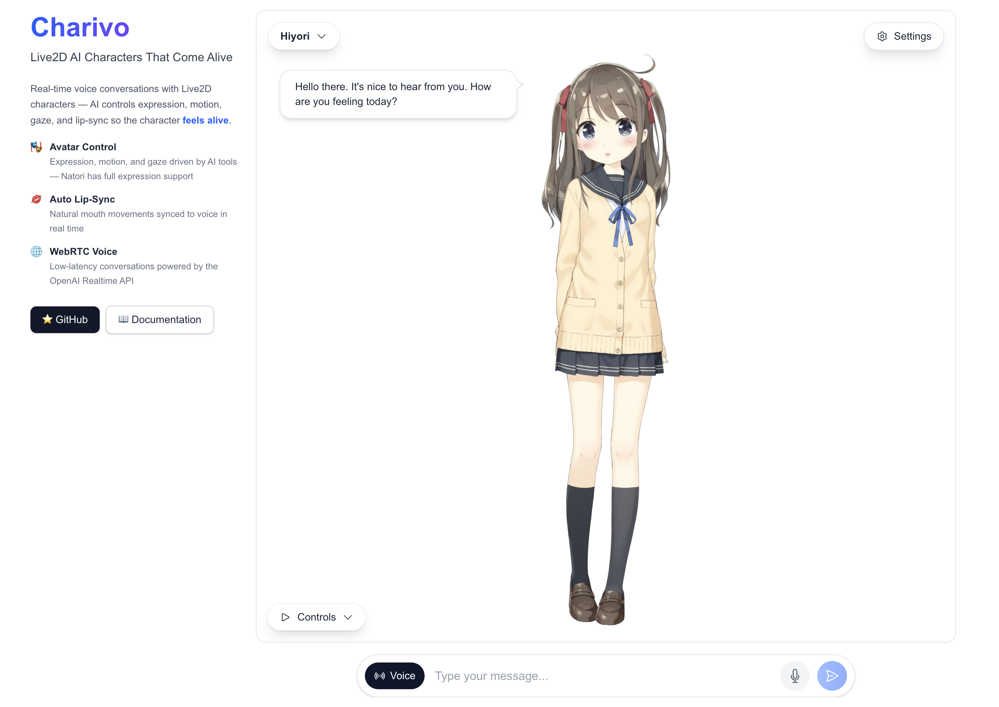

# Charivo

Build Live2D AI characters that talk, react, and look at you.

Charivo is a modular TypeScript framework for voice, expression, motion, gaze,
and real-time conversation. It separates orchestration, stateful managers,
browser-side clients, and server-side providers so you can swap pieces without
rewriting the whole stack.

Live demo: https://charivo.vercel.app/



Documentation:

- [https://zeikar.github.io/charivo/](https://zeikar.github.io/charivo/)
- [ROADMAP.md](./ROADMAP.md): Amadeus product roadmap and current phase status

## Quick Start

```bash
pnpm add \
  @charivo/core \
  @charivo/llm \
  @charivo/tts \
  @charivo/render @charivo/render-live2d
```

```ts
import { Charivo, CharivoError } from "@charivo/core";
import { createLLMManager } from "@charivo/llm";
import { createRemoteLLMClient } from "@charivo/llm/remote";
import { createTTSManager } from "@charivo/tts";
import { createRemoteTTSPlayer } from "@charivo/tts/remote";
import { createRenderManager } from "@charivo/render";
import { createLive2DRenderer } from "@charivo/render-live2d";

const canvas = document.querySelector("canvas")!;

const charivo = new Charivo();

const renderer = createLive2DRenderer({ canvas });
const renderManager = createRenderManager(renderer, {
  canvas,
  mouseTracking: "document",
});
await renderManager.initialize();
await renderManager.loadModel("/live2d/Hiyori/Hiyori.model3.json");

charivo.attachRenderer(renderManager);
charivo.attachLLM(
  createLLMManager(createRemoteLLMClient({ apiEndpoint: "/api/chat" })),
);
charivo.attachTTS(
  createTTSManager(createRemoteTTSPlayer({ apiEndpoint: "/api/tts" })),
);

charivo.setCharacter({
  id: "hiyori",
  name: "Hiyori",
  personality: "Cheerful and helpful assistant",
  voice: { voiceId: "marin" },
});

try {
  await charivo.userSay("Hello");
} catch (error) {
  if (error instanceof CharivoError) {
    console.error(error.code, error.message);
  }
  throw error;
}

await charivo.dispose();
```

For a complete app, see [`examples/web`](./examples/web).

## Choosing Packages

Use the remote/server-mediated path by default:

- LLM: `@charivo/llm/remote` + a server route using a provider package such as `@charivo/server/openai` or `@charivo/server/openclaw`
- TTS: `@charivo/tts/remote` + `@charivo/server/openai`
- STT: `@charivo/stt/remote` + `@charivo/server/openai`
- Realtime: `@charivo/realtime/remote` + a server route using a provider package such as `@charivo/server/openai`

Direct browser packages are for local development, demos, and testing only:

- `@charivo/llm/openai`
- `@charivo/llm/openclaw`
- `@charivo/realtime/openai`
- `@charivo/tts/openai`
- `@charivo/stt/openai`

Browser-native packages are useful when you explicitly want no server dependency:

- `@charivo/tts/web`
- `@charivo/stt/web`

## Architecture

```text
App
  -> @charivo/core
  -> modality packages (@charivo/llm, @charivo/tts, @charivo/stt, @charivo/realtime, @charivo/render)
  -> browser implementations via subpath exports
  -> optional server providers behind API routes
```

- `@charivo/core` owns shared domain types, the event bus, and the `Charivo` orchestrator.
- modality root packages own stateful manager logic.
- browser adapters live on explicit subpaths such as `@charivo/llm/remote` and `@charivo/realtime/openai-agents`.
- `@charivo/server/*` holds server-side providers and credentials.

See the [Architecture guide](https://zeikar.github.io/charivo/architecture/) for
event wiring, package roles, and detailed layering.

## Package Map

Core:

- `@charivo/core`: orchestrator, event bus, domain types

LLM:

- `@charivo/llm`: stateful conversation manager
- `@charivo/llm/remote`: browser client for server API routes
- `@charivo/llm/openai`: direct OpenAI browser client, dev/testing only
- `@charivo/llm/openclaw`: direct OpenClaw browser client, dev/testing only
- `@charivo/llm/stub`: canned responses for tests and demos
- `@charivo/server/openai`: server-side OpenAI provider exports
- `@charivo/server/openclaw`: server-side OpenClaw provider exports

TTS:

- `@charivo/tts`: TTS session manager and lip-sync coordination
- `@charivo/tts/remote`: browser player for server TTS routes
- `@charivo/tts/openai`: direct OpenAI browser player, dev/testing only
- `@charivo/tts/web`: Web Speech API player
- `@charivo/server/openai`: exports `createOpenAITTSProvider(...)`

STT:

- `@charivo/stt`: STT session manager and recording helper
- `@charivo/stt/remote`: browser transcriber for server STT routes
- `@charivo/stt/openai`: direct OpenAI browser transcriber, dev/testing only
- `@charivo/stt/web`: Web Speech API transcriber
- `@charivo/server/openai`: exports `createOpenAISTTProvider(...)`

Realtime:

- `@charivo/realtime`: provider-agnostic realtime manager, tool registry, typed state, and session config helpers
  Supports explicit `updateSession(...)` session patching without a reconnect.
- `@charivo/realtime-avatar`: optional avatar tool definitions and result projector bridge
- `@charivo/realtime/remote`: adapter-dispatched browser client for server realtime routes
- `@charivo/realtime/openai-agents`: OpenAI Agents SDK realtime transport client and adapter
- `@charivo/realtime/openai`: legacy low-level OpenAI realtime transport client and adapter
- `@charivo/server/openai`: exports `createOpenAIRealtimeProvider(...)`

Rendering:

- `@charivo/render`: render manager, mouse tracking, lip-sync bridge
- `@charivo/render-live2d`: Live2D Cubism renderer
- `@charivo/render/stub`: console renderer for tests and demos

## Contributing

See [`docs/release-checklist.md`](./docs/release-checklist.md) for validation
commands, versioning rules, and release procedures.

## TypeScript Note

Subpath imports such as `@charivo/llm/remote` and `@charivo/server/openai`
require a module resolution mode that understands package exports:
`"bundler"`, `"node16"`, or `"nodenext"`.

## Live2D Note

`@charivo/render-live2d` vendors parts of the Live2D Cubism SDK for Web.
If you ship or republish that package, review the Live2D license terms before release.

---

**Built with [HyperClaude](http://zeikar.dev/hyperclaude/)** — *Claude builds, Codex critiques.*
