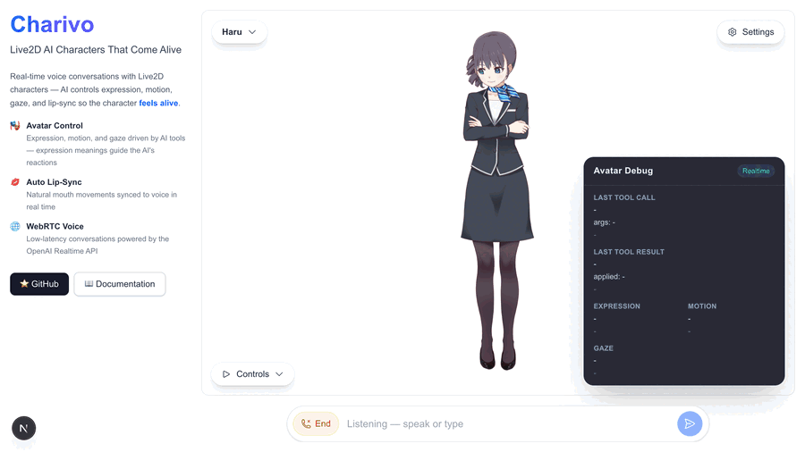

# Charivo

[](https://github.com/zeikar/charivo/actions/workflows/ci.yml)
[](https://www.npmjs.com/package/@charivo/core)
[](https://www.npmjs.com/package/@charivo/core)
[](./LICENSE)
[](http://zeikar.dev/hyperclaude/)

Build Live2D AI characters that talk, react, and look at you.

Charivo is a modular TypeScript framework for voice, expression, motion, gaze,
and real-time conversation. It separates orchestration, stateful managers,
browser-side clients, and server-side providers so you can swap pieces without
rewriting the whole stack.

<!-- Recorded by `pnpm demo:gif`. Re-record rather than hand-edit. -->


## Live demos

- Live2D web app — https://charivo.vercel.app/
- Companion (Realtime voice + cross-session memory) — https://charivo-companion.vercel.app/

## Documentation

- [https://zeikar.dev/charivo/](https://zeikar.dev/charivo/)

## Built with Charivo

- LiveClaw (Electron desktop companion driven by a local OpenClaw agent) — https://github.com/zeikar/liveclaw

## Try it locally

Want to watch a full Live2D character talk before wiring your own app? The
[`examples/web`](./examples/web) demo bundles the Live2D models and every
modality. Clone the repo, add an OpenAI key (and a Gemini key for realtime
voice, which defaults to Gemini Live), and run:

```bash
pnpm install
cp examples/web/.env.example examples/web/.env.local   # then set OPENAI_API_KEY and GEMINI_API_KEY
pnpm dev:web
```

Open <http://localhost:3000>. The in-app settings menu lets you compare the
server-mediated (production) and browser-direct dev clients for chat, TTS, and
STT; realtime voice always uses the server route in this demo, and the same
menu switches it between Gemini Live and OpenAI Realtime.

The snippets below are for adding Charivo to your own app, not for pasting into
an empty file — a Live2D scene needs a canvas, the Cubism runtime, model assets,
and a bundler, which the demo above already wires up.

## Quick Start

This snippet runs entirely in the browser with no server — paste it in, drop in
an OpenAI API key, and it works. It uses the direct browser clients
(`@charivo/llm/openai`, `@charivo/tts/openai`), which are for local development
and demos only. They expose your API key in the browser, so for production use
the server-mediated path instead (see [Choosing Packages](#choosing-packages)).

```bash
pnpm add \
  @charivo/core \
  @charivo/llm \
  @charivo/tts \
  @charivo/render @charivo/render-live2d
```

```ts
import { createCharivo, isCharivoError } from "@charivo/core";
import { createLLMManager } from "@charivo/llm";
import { createOpenAILLMClient } from "@charivo/llm/openai";
import { createTTSManager } from "@charivo/tts";
import { createOpenAITTSPlayer } from "@charivo/tts/openai";
import { createRenderManager } from "@charivo/render";
import { createLive2DRenderer } from "@charivo/render-live2d";

// Dev/demo only: this key is shipped to the browser. Never do this in production.
const OPENAI_API_KEY = "sk-...";

const canvas = document.querySelector("canvas")!;

const renderManager = createRenderManager(createLive2DRenderer({ canvas }), {
  canvas,
  mouseTracking: "document",
});
await renderManager.initialize();
await renderManager.loadModel?.("/live2d/Hiyori/Hiyori.model3.json");

const charivo = createCharivo({
  renderer: renderManager,
  llm: createLLMManager(createOpenAILLMClient({ apiKey: OPENAI_API_KEY })),
  tts: createTTSManager(createOpenAITTSPlayer({ apiKey: OPENAI_API_KEY })),
  character: {
    id: "hiyori",
    name: "Hiyori",
    personality: "Cheerful and helpful assistant",
    voice: { voiceId: "marin" },
  },
});

try {
  await charivo.userSay("Hello");
} catch (error) {
  if (isCharivoError(error)) {
    console.error(error.code, error.message);
  }
  throw error;
}

await charivo.dispose();
```

For a complete app with the production server-mediated path, see
[`examples/web`](./examples/web).

Text chat can also drive the character's face and body: register the
catalog-constrained tools from `@charivo/avatar` on the LLM manager and the
model calls `setExpression` / `playMotion` / `lookAt` while it replies. See the
[LLM guide's avatar tool-calling walkthrough](./docs/guide/llm.md#avatar-tool-calling)
for the wiring.

## Realtime Voice

For low-latency, speech-to-speech conversation, attach a realtime manager
instead of the LLM + TTS pair. Like the Quick Start above, this runs with no
server: pass an OpenAI API key and the browser mints a short-lived realtime
client secret directly, then streams microphone audio in and plays the model's
voice back.

```bash
pnpm add \
  @charivo/core \
  @charivo/realtime \
  @charivo/render @charivo/render-live2d
```

```ts
import { createCharivo } from "@charivo/core";
import {
  buildRealtimeSessionConfig,
  createRealtimeManager,
} from "@charivo/realtime";
import { createOpenAIRealtimeAgentsClient } from "@charivo/realtime/openai-agents";
import { createRenderManager } from "@charivo/render";
import { createLive2DRenderer } from "@charivo/render-live2d";

// Dev/demo only: this key is exposed in the browser. Never ship it to production.
const OPENAI_API_KEY = "sk-...";

const canvas = document.querySelector("canvas")!;

const renderManager = createRenderManager(createLive2DRenderer({ canvas }), {
  canvas,
  mouseTracking: "document",
});
await renderManager.initialize();
await renderManager.loadModel?.("/live2d/Hiyori/Hiyori.model3.json");

const charivo = createCharivo({
  renderer: renderManager,
  realtime: createRealtimeManager(
    createOpenAIRealtimeAgentsClient({ apiKey: OPENAI_API_KEY }),
  ),
  character: {
    id: "hiyori",
    name: "Hiyori",
    personality: "Cheerful and helpful assistant",
    voice: { voiceId: "marin" },
  },
});

// Start a live mic session (speech in, voice out). Call this from a user
// gesture (e.g. a button click), on localhost or https — the mic needs it.
const realtime = charivo.getRealtimeManager()!;
const base = buildRealtimeSessionConfig({
  character: charivo.getCurrentCharacter(),
});

await realtime.startSession({
  provider: "openai",
  model: "gpt-realtime-2.1-mini",
  instructions: base.instructions,
});

// End the live session when the conversation is over.
await realtime.stopSession();

await charivo.dispose();
```

`createOpenAIRealtimeAgentsClient({ apiKey })` is **dev/testing only** — the key
is exposed in the browser, and a live session needs microphone permission, a
secure context (`localhost` or `https`), and a user gesture (e.g. a button
click) to start; the minted client secret is short-lived, so a fresh one is
requested per session. For production, swap the direct client for the
server-mediated `@charivo/realtime/remote` client backed by a server route (see
[Choosing Packages](#choosing-packages)).

Gemini Live is the other realtime provider, and the swap is the client plus
the `startSession` call — the manager, character, and avatar wiring do not
change. `createGeminiLiveClient({ apiKey })` is the same dev/testing-only
shortcut: it mints Google's single-use ephemeral token in the browser.

```ts
import { createGeminiLiveClient } from "@charivo/realtime/gemini";

// Dev/demo only, exactly like the OpenAI key above.
const GEMINI_API_KEY = "AIza...";

const charivo = createCharivo({
  renderer: renderManager,
  realtime: createRealtimeManager(
    createGeminiLiveClient({ apiKey: GEMINI_API_KEY }),
  ),
  character,
});

await charivo.getRealtimeManager()!.startSession({
  provider: "gemini",
  transport: "websocket",
  instructions: base.instructions,
});
```

For production, both providers run through `@charivo/realtime/remote` and a
server route backed by `@charivo/server/openai` or `@charivo/server/gemini`;
the [Realtime guide](./docs/guide/realtime.md#provider-route) shows that route
for both.

To let the live model drive avatar expressions and motions, register the avatar
tools and result projector from `@charivo/avatar` (the same tools also work
with `@charivo/llm`'s `LLMManager`; formerly published as
`@charivo/realtime-avatar`). See [`examples/web`](./examples/web) for the
full server wiring and the [Companion demo](https://charivo-companion.vercel.app/)
for realtime voice with cross-session memory.

## Choosing Packages

Use the remote/server-mediated path by default:

- LLM: `@charivo/llm/remote` + a server route using a provider package such as `@charivo/server/openai` or `@charivo/server/openclaw`
- TTS: `@charivo/tts/remote` + `@charivo/server/openai`
- STT: `@charivo/stt/remote` + `@charivo/server/openai`
- Realtime: `@charivo/realtime/remote` + a server route using a provider package such as `@charivo/server/openai` or `@charivo/server/gemini`

Direct browser packages are for local development, demos, and testing only:

- `@charivo/llm/openai`
- `@charivo/llm/openclaw`
- `@charivo/realtime/openai-agents` (dev `apiKey` mints the client secret in-browser)
- `@charivo/realtime/gemini` (dev `apiKey` mints the ephemeral token in-browser)
- `@charivo/tts/openai`
- `@charivo/stt/openai`

`@charivo/realtime/openai` is server-mediated despite being a direct transport —
it accepts only `apiEndpoint` or `sessionBootstrap` and never takes a key.

The dev/testing-only classification above applies to the browser client, player,
or transcriber factory on each of these four subpaths
(`createOpenAILLMClient`, `createOpenClawLLMClient`, `createOpenAITTSPlayer`,
`createOpenAISTTTranscriber`). The same subpaths also export the server-side
provider (`createOpenAILLMProvider`, `createOpenClawLLMProvider`,
`createOpenAITTSProvider`, `createOpenAISTTProvider`), which refuses to run in a
browser unless you pass `dangerouslyAllowBrowser: true`.

Browser-native packages are useful when you explicitly want no server dependency:

- `@charivo/tts/web`
- `@charivo/stt/web`

## Architecture

```text
App
  -> @charivo/core
  -> modality packages (@charivo/llm, @charivo/tts, @charivo/stt, @charivo/realtime, @charivo/render)
  -> browser implementations via subpath exports
  -> optional server providers behind API routes
```

- `@charivo/core` owns shared domain types, the event bus, and the `Charivo` orchestrator.
- modality root packages own stateful manager logic.
- browser adapters live on explicit subpaths such as `@charivo/llm/remote` and `@charivo/realtime/openai-agents`.
- `@charivo/server/*` is the recommended server-side entry point: it keeps
  credential use out of browser code and implements the realtime session
  bootstrap, while re-exporting the LLM/TTS/STT providers implemented in the
  modality packages (it accepts credentials from your app config; it does not
  store or own them).

See the [Architecture guide](https://zeikar.dev/charivo/architecture/) for
event wiring, package roles, and detailed layering.

## Package Map

Core:

- `@charivo/core`: orchestrator, event bus, domain types

LLM:

- `@charivo/llm`: stateful conversation manager
- `@charivo/llm/remote`: browser client for server API routes
- `@charivo/llm/openai`: direct OpenAI browser client (dev/testing only) and the
  `createOpenAILLMProvider` server-side provider
- `@charivo/llm/openclaw`: direct OpenClaw browser client (dev/testing only)
  and the `createOpenClawLLMProvider` server-side provider
- `@charivo/llm/stub`: canned responses for tests and demos
- `@charivo/server/openai`: re-exports `createOpenAILLMProvider` from
  `@charivo/llm/openai` (realtime is implemented here; see Realtime below)
- `@charivo/server/openclaw`: re-exports `createOpenClawLLMProvider` from
  `@charivo/llm/openclaw`

TTS:

- `@charivo/tts`: TTS session manager and lip-sync coordination
- `@charivo/tts/remote`: browser player for server TTS routes
- `@charivo/tts/openai`: direct OpenAI browser player (dev/testing only) and
  the `createOpenAITTSProvider` server-side provider
- `@charivo/tts/web`: Web Speech API player
- `@charivo/server/openai`: re-exports `createOpenAITTSProvider(...)` from
  `@charivo/tts/openai`

STT:

- `@charivo/stt`: STT session manager and recording helper
- `@charivo/stt/remote`: browser transcriber for server STT routes
- `@charivo/stt/openai`: direct OpenAI browser transcriber (dev/testing only)
  and the `createOpenAISTTProvider` server-side provider
- `@charivo/stt/web`: Web Speech API transcriber
- `@charivo/server/openai`: re-exports `createOpenAISTTProvider(...)` from
  `@charivo/stt/openai`

Realtime:

- `@charivo/realtime`: provider-agnostic realtime manager, tool registry, typed state, and session config helpers
  Supports explicit `updateSession(...)` session patching without a reconnect on the OpenAI transports.
- `@charivo/realtime/remote`: adapter-dispatched browser client for server realtime routes
- `@charivo/realtime/openai-agents`: OpenAI Agents SDK realtime transport client and adapter
- `@charivo/realtime/openai`: legacy low-level OpenAI realtime transport client and adapter
- `@charivo/realtime/gemini`: Gemini Live WebSocket realtime transport client and adapter
- `@charivo/server/openai`: exports `createOpenAIRealtimeProvider(...)`
- `@charivo/server/gemini`: exports `createGeminiRealtimeProvider(...)`

Avatar:

- `@charivo/avatar`: catalog-constrained avatar expression/motion/gaze tool
  definitions, instructions, and a result projector, for use with either
  `@charivo/llm` or `@charivo/realtime`

Rendering:

- `@charivo/render`: render manager, mouse tracking, lip-sync bridge
- `@charivo/render-live2d`: Live2D Cubism renderer
- `@charivo/render/stub`: console renderer for tests and demos

## Contributing

See [`docs/release-checklist.md`](./docs/release-checklist.md) for validation
commands, versioning rules, and release procedures.

## TypeScript Note

Subpath imports such as `@charivo/llm/remote` and `@charivo/server/openai`
require a module resolution mode that understands package exports:
`"bundler"`, `"node16"`, or `"nodenext"`.

## Live2D Note

`@charivo/render-live2d` is the only package that is **not MIT**. It bundles the
Live2D Cubism SDK for Web: Cubism Core under the Live2D Proprietary Software
License (bundled as Redistributable Code, which that license permits) and the
Cubism Framework plus sample-derived code under the Live2D Open Software
License. Every other `@charivo/*` package is MIT.

Publishing a product built on it requires a **Live2D Publication License
Agreement** — marketed as the *Cubism SDK Release License*, one instrument under
two names. Individuals and organizations under 10,000,000 JPY in recent-year
sales may be exempt, **except for an "Expandable Application"**, which needs
Live2D's prior approval on top of the agreement. Whether that category reaches a
developer library is unsettled; a product that lets end users load their own
models is much closer to it.

Note also that this package **bundles the Cubism Core** rather than having you
fetch it from Live2D — permitted by Live2D's own `RedistributableFiles.txt`, but
not what most Live2D libraries do.

Charivo has not sought Live2D's approval and cannot grant you anything here. See
[`packages/render-live2d/LICENSE.md`](./packages/render-live2d/LICENSE.md) for
the clause-by-clause breakdown, and settle your own position with Live2D before
you ship.

The Live2D models in the demos are separate again — they are Free Material
License assets credited in each demo's README, and no model ships on npm.
